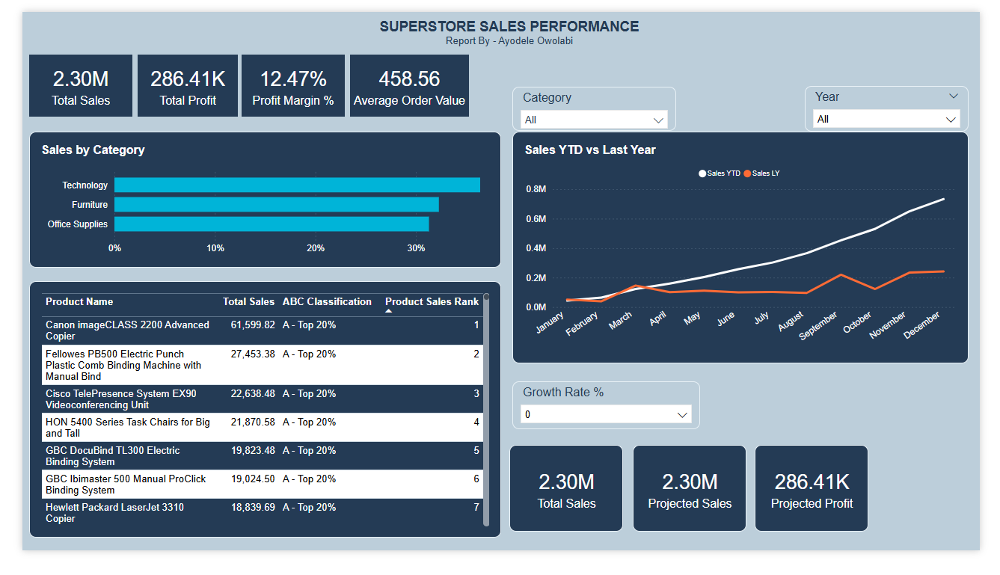

# Superstore Sales Performance Dashboard
**Tool:** Microsoft Power BI | **Type:** Capstone Project 1  
**Author:** Ayodele Owolabi | Tenax Systems

---

## Project Overview
An end-to-end Power BI dashboard built on the Superstore retail dataset 
demonstrating a full BI development workflow — from raw data ingestion and 
data modelling through to advanced DAX and interactive dashboard design.

---

## Dashboard Preview

---

## Data Model
Built a star schema from a single flat CSV file by splitting into dimension 
and fact tables inside Power Query:

| Table | Type |
|---|---|
| Orders | Fact |
| Customers | Dimension |
| Products | Dimension |
| Date | Dimension (DAX generated) |

---

## DAX Measures Built (17 Total)

### Base Measures
| Measure | Function Used |
|---|---|
| Total Sales | SUM |
| Total Profit | SUM |
| Total Orders | DISTINCTCOUNT |
| Total Quantity | SUM |
| Average Order Value | DIVIDE |
| Profit Margin % | DIVIDE |

### Time Intelligence
| Measure | Function Used |
|---|---|
| Sales YTD | TOTALYTD |
| Sales MTD | TOTALMTD |
| Sales Last Year | CALCULATE + SAMEPERIODLASTYEAR |
| YoY Growth % | DIVIDE |
| Sales Last 30 Days | CALCULATE + DATESINPERIOD |

### Advanced DAX
| Measure | Function Used |
|---|---|
| Sales % of Total | CALCULATE + ALL |
| Product Sales Rank | RANKX |
| Is Top 10 Product | IF + RANKX |
| ABC Classification | VAR + IF + RANKX |
| Projected Sales | SELECTEDVALUE |
| Projected Profit | SELECTEDVALUE |

---

## Key Dashboard Features
- Cross-visual filtering by Category and Year
- Sales YTD vs Last Year trend line
- ABC product classification (A/B/C tier segmentation)
- Dynamic What-If growth scenario modeller (0%, 10%, 25%, 50%)
- Top products ranked by total sales

---

## Files
| File | Description |
|---|---|
| `Capstone_Project.pbix` | Power BI Desktop file — download to explore |
| `Superstore_Sales_Dashboard.pdf` | Static PDF export for quick viewing |
| `dashboard_screenshot.png` | Dashboard preview image |

---

## Skills Demonstrated
Power BI Desktop · DAX · Power Query · Star Schema Modelling ·
Time Intelligence · RANKX · CALCULATE · What-If Parameters ·
Data Visualisation · Dashboard Design

---

*Part of a structured DAX and Power BI learning programme.  
Project 2 — UK Energy & Economic Indicators Dashboard — coming soon.*
